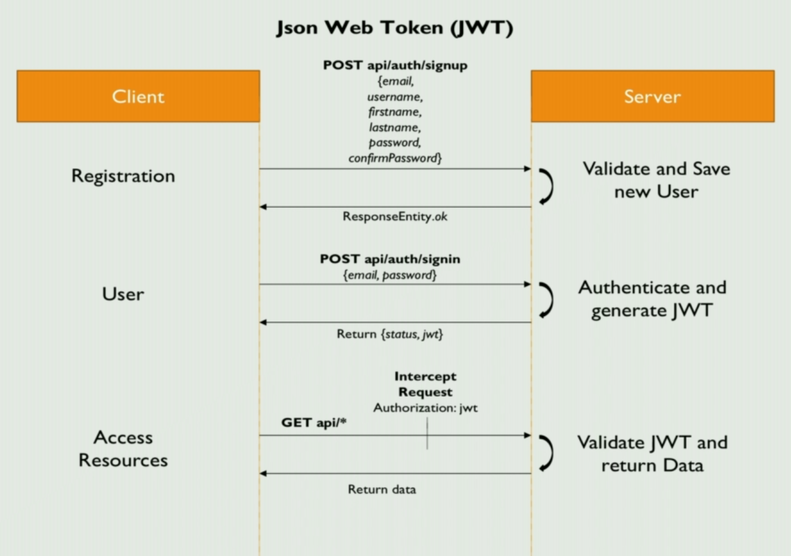

# Instagram. Backend API

## 1. Technical Selection
### 1.1. Backend Technology

- Spring boot
- Spring data JPA
- Flyway
- SpringDoc
- Postgresql
- Mapstruct
- Lombok

## 2. Installation
1. Setup db connection in application.properties and create new db "instagram"
2. Run backend app
3. profit

## 3. Security



### 3.1. Dependencies:
```
implementation 'org.springframework.boot:spring-boot-starter-security'
implementation "com.google.code.gson:gson:${gsonVersion}"
implementation "io.jsonwebtoken:jjwt:${jjwtVersion}"
```

### 3.2. Security implementation (step by step)

1. Open the user model class and specify that the user extends the UserDetail class. This is necessary because spring
   security work with UserDetails class or subclasses. **_Notice! we can use UserDetail class separately from User class (
   use this org.springframework.security.core.userdetails.User), it is nothing wrong with this, or we can extend own
   user class like in this example._**
2. Create class CustomUserDetailsService. (Spring will be called this class automatically when the user tries to sing in)

3. Create class **CustomUserDetailsService**. (Spring will be called this class automatically when the user tries to sing
  in)
   - Create method **public UserDetails loadUserByUsername(String username)**. Notice that method should return
     UserDetail instance
      - Implement user extraction from the database by username and check that user is existed. We are use
        UserRepository for this.
      - Create list of Granted authorities used next example:
        `List<GrantedAuthority> grantedAuthorities = new ArrayList<>(); grantedAuthorities.add(new SimpleGrantedAuthority(account.getRole()));`
      - Create new user:
        `return new User(username, userPassword, grantedAuthorities);`
         - Or from package **org.springframework.security.core.userdetails.User**
         - Or our own User class that is extends UserDetail class
4. Create package constant
   - Create class SecurityConstant
      - public static final String SIGN_UP_URLS = "api/auth/**";
      - public static final String SECRET = "SecretKeyGenJWT";
      - public static final String TOKEN_PREFIX = "Bearer ";
      - public static final String HEADER_STRING = "Authorization";
      - public static final String CONTENT_TYPE = "application/json";
      - public static final long EXPIRATION_TIME = 600_000; //ms
5. Create **JWTTokenProvider** class. Class for generating and validating JWT token
   - public String generateToken(Authentication authentication)
   - public boolean validateToken(String token)
   - public Claims getClaims(String token)
   - public Long getUserIdFromToken(String token)
6. Create **JWTAuthenticationFilter**. class is executed for any incoming requests and validate JWT from the request and
  sets it in the context to indicate that logged in user is authenticated.
   - protected void doFilterInternal(HttpServletRequest request, HttpServletResponse response, FilterChain filterChain)
   - private String getJWTFromRequest(HttpServletRequest request)
7. Create **JWTAuthenticationEntryPoint**. This class rejects unauthenticated request and send error code 401.
   - public void commence(). Describe response.sendError(HttpServletResponse.SC_UNAUTHORIZED, "Unauthorized");
8. Create **SecurityConfig** extends WebSecurityConfigurerAdapter. That is configuration class
   - protected void configure(HttpSecurity http). That describe rules of authentication.
   - bean BCryptPasswordEncoder bCryptPasswordEncoder()
   - public AuthenticationManager authenticationManagerBean()
   - protected void configure(AuthenticationManagerBuilder auth)

9. Create **dto.request.LoginRequest** class. Instance of that class we will transfer to the server, when user is sign in.
  Each variable of this class should be validated through annotations
   - private String username;
   - private String password;
10. Create **dto.request.SignupRequest** class. Instance of that class we will transfer to the server, when user is sign up.
    - private String email;
    - private String firstname;
    - private String lastname;
    - private String username;
    - private String password;
    - private String confirmPassword;
11. Create new annotation **annotations.ValidPassword** class. We are use this annotation for password variable in
    dto.request.SignupRequest class
     - Create **validation.PasswordMatchValidator** class. That class will be linked with annotation and make validation
       for password.

12. Create **service.UserService** class
     - public User createUser(SignupRequest signupRequest). Transactional method that save new user or throw
       UserExistException if user already exist.
13. Create **exceptions.UserExistException** class. Extend Runtime exception and add annotation @ResponseStatus(
    HttpStatus.BAD_REQUEST)
14. Create validation.ResponseErrorValidation class. That class intercept all error that we throw through annotation
    @NotEmpty, @NotBlank, @ValidPassword.
     - public **ResponseEntity\<Object\> mapValidationService(BindingResult result)**
15. Create **controller.AuthController** class. That class should be cross-origin, rest, and work on addresses
    /api/auth/\*\*
     - private JWTTokenProvider jwtTokenProvider;
     - private AuthenticationManager authenticationManager;
     - private ResponseErrorValidation responseErrorValidation;
     - private UserService userService;
     - @PostMapping(/signup) public ResponseEntity\<Object\> registerUser(
       @Valid @RequestBody SignupRequest signupRequest, BindingResult bindingResult)
        - Create class dto.response.MessageResponse. We are return that class in ResponseEntity. return
          ResponseEntity.ok(new MessageResponse("User registered successfully"))
     - @PostMapping(/signin) public ResponseEntity\<Object\> authenticateUser(
       @Valid @RequestBody LoginRequest loginRequest, BindingResult bindingResult)
        - generate and return jwt
        - Create class dto.response.JWTTokenSuccessResponse. We are return that class in ResponseEntity. return
          ResponseEntity.ok(new JWTTokenSuccessResponse(true, jwtToken))
           - private boolean success
           - private String jwt


### 3.3. Summary

- What is going on when user is sign in?
   - **JWTAuthenticationFilter.doFilterInternal**.
      - get **jwt** and validate it into **JWTTokenProvider.generateToken**
         - if **jwt** valid then get load user by user id
         - create authentication with user and user roles and put it into security context.
   - **AuthController.authenticateUser**
      - Check error. If they are, then throw response with errors.
      - create **authentication** with username and password
      - If username and password correct
         - When we create authentication, spring automatically call **CustomUserDetailsService.loadUserByUsername**
           and return userDetails.
         - If authentication is **success** then we put it into **security context**.
         - Generate and return **JWT**
      - Else username and password is not correct
         - When we create authentication, it **throw** exception with BAD CREDENTIAL
         - **JWTAuthenticationEntryPoint.commence** that pack error in response entity and throw it to client.
- What is going on when user is sign up?
   - **JWTAuthenticationFilter.doFilterInternal**.
      - get **jwt** and validate it into **JWTTokenProvider.generateToken**
         - if **jwt** valid then get load user by user id
         - create authentication with user and user roles and put it into security context.
   - **AuthController.authenticateUser**
      - Check error. If they is, then throw response with errors.
      - Create new user

